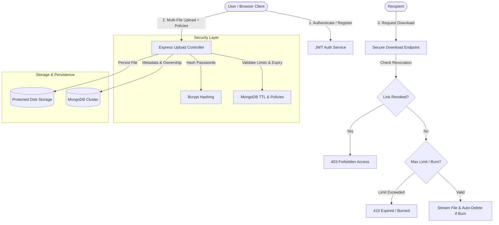

# DropVault – Secure Zero-Exposure File Sharing Platform

<div align="center">
  
  <h3>Enterprise-Grade Secure File Sharing with Granular Link Controls</h3>

  [](https://reactjs.org/)
  [](https://tailwindcss.com/)
  [](https://nodejs.org/)
  [](https://expressjs.com/)
  [](https://www.mongodb.com/)
  [](https://jwt.io/)
</div>

---

## 📌 Overview

**DropVault** is a modern, high-performance secure file sharing platform engineered to eliminate data exposure and empower users with granular link control. Built on the **MERN** stack with **Tailwind CSS v3**, it supports end-to-end access management including instant link revocation, self-destructing transfers, strict download limits, and real-time analytics.

---

## 🏗️ Architecture & Security Workflow



---

## ✨ Key Features

### 🛡️ Granular Access & Security Controls
* **Instant Link Revocation:** Disable public access to any active download link immediately from your dashboard without deleting underlying files, with the ability to restore access at any time.
* **Self-Destruct ("Burn After Reading"):** Enables single-use sharing where the file and its database record are atomically and permanently purged immediately upon the first successful download.
* **Max Download Restrictions:** Enforce strict download limits (e.g., max 1, 5, 10 downloads) before links auto-expire.
* **Password Authentication:** Protect sensitive transfers with Bcrypt-hashed password requirements.
* **Automated Expiration:** Customizable expiration windows (1, 3, 7, 30 days) handled automatically via MongoDB TTL background indexing.

### 📊 User Workspace & Real-Time Analytics
* **Interactive Dashboard:** Live summary metrics for Total Files Uploaded, Total Downloads, Active Links, and Storage Footprint.
* **File Management System:** Searchable and filterable vault (`All`, `Active`, `Revoked`, `Expired`) with real-time status indicators.
* **Mobile QR Sharing:** Instant QR code modal generator for sharing files directly to mobile devices.
* **Dual Upload Mode:** Seamless guest uploads for quick sharing or authenticated workspace uploads with persistent management.

### 🎨 Modern UI & Polish
* **Tailwind CSS v3:** Sleek dark glassmorphic design (`#070b14`), glowing accent borders, and Lucide React icons.
* **Drag-and-Drop Uploader:** Multi-file drag and drop uploader with real-time percentage progress bar and preview cards.
* **Responsive Feedback:** Toast notification system for link copying, status toggling, and file actions.

---

## 🖥️ Tech Stack

| Layer | Technology |
|---|---|
| **Frontend** | React 18, Tailwind CSS v3, PostCSS, Vite, Lucide React, Axios, QRCode.react |
| **Backend** | Node.js, Express.js 5, Multer, Mongoose |
| **Authentication** | JSON Web Tokens (`jsonwebtoken`), `bcryptjs` (salt rounds: 10) |
| **Database** | MongoDB Atlas (TTL indexed collections) |

---

## 🚀 Getting Started

### 1. Clone the Repository
```bash
git clone https://github.com/dhruv1955/DropVault.git
cd DropVault
```

### 2. Backend Setup
```bash
cd server
npm install
```

Create a `.env` file in the `server` directory:
```env
PORT=8000
MONGO_URI=your_mongodb_connection_string
JWT_SECRET=your_super_secret_jwt_key
PUBLIC_BASE_URL=http://localhost:8000
CORS_ORIGINS=http://localhost:5173
```

Start the backend server:
```bash
npm run dev
```

### 3. Frontend Setup
```bash
cd ../client
npm install
```

Create a `.env` file in the `client` directory:
```env
VITE_API_URL=http://localhost:8000
```

Start the frontend development server:
```bash
npm run dev
```

---

## 📡 API Reference

### Authentication
| Method | Route | Description |
|---|---|---|
| `POST` | `/api/auth/register` | Register a new user account |
| `POST` | `/api/auth/login` | Log in and receive JWT bearer token |
| `GET` | `/api/auth/me` | Fetch authenticated user profile |

### User Workspace & Management
| Method | Route | Description |
|---|---|---|
| `GET` | `/api/user/files` | Get all uploaded files for logged-in user |
| `GET` | `/api/user/stats` | Fetch aggregate metrics (files, downloads, storage) |
| `PATCH` | `/api/user/files/:id/revoke` | Toggle link active / revoked access status |
| `DELETE` | `/api/user/files/:id` | Permanently delete file from disk & database |

### Public File Sharing
| Method | Route | Description |
|---|---|---|
| `POST` | `/upload` | Upload single or multiple files (guest or authenticated) |
| `GET` | `/file/:fileId/info` | Fetch public file metadata without downloading |
| `GET` | `/file/:fileId` | Secure download route with password, limit, & revocation checks |

---

## 📄 License

© 2026 Dhruv Yadav.  
All rights reserved.  
This project and its source code cannot be copied, modified, or distributed without explicit permission from the author.
